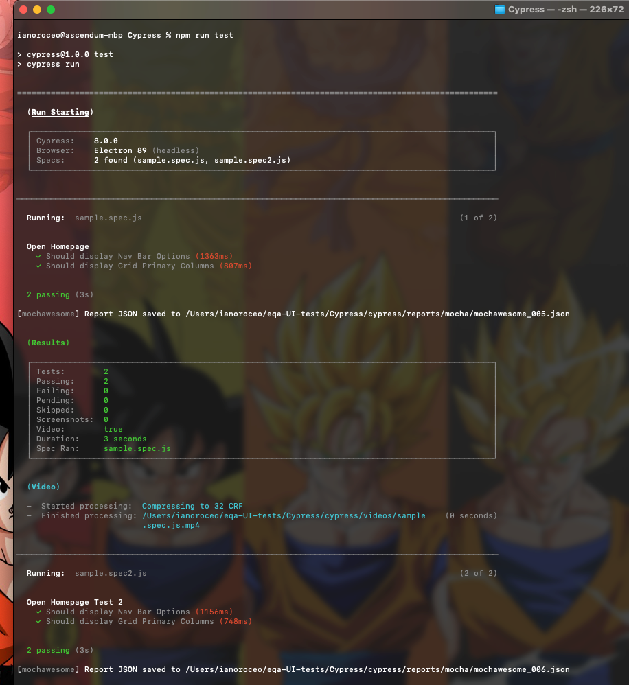
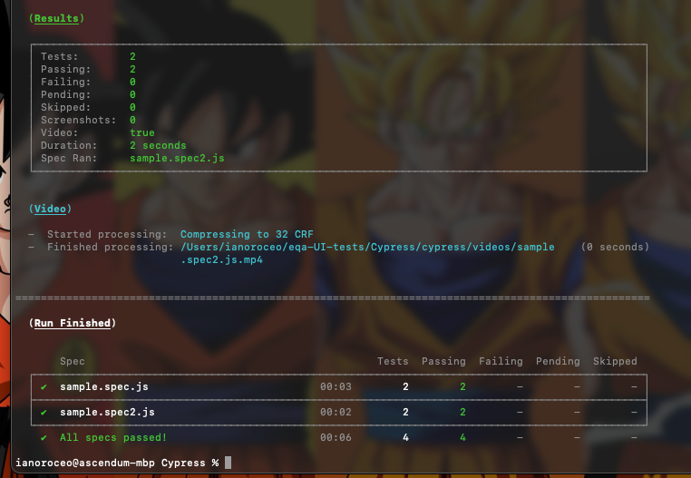
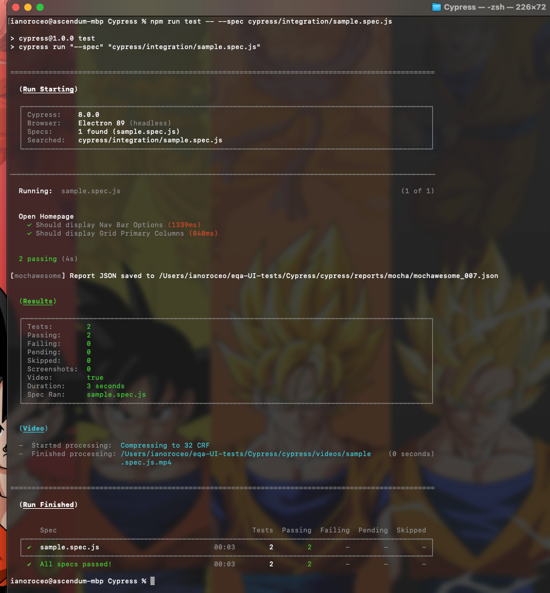
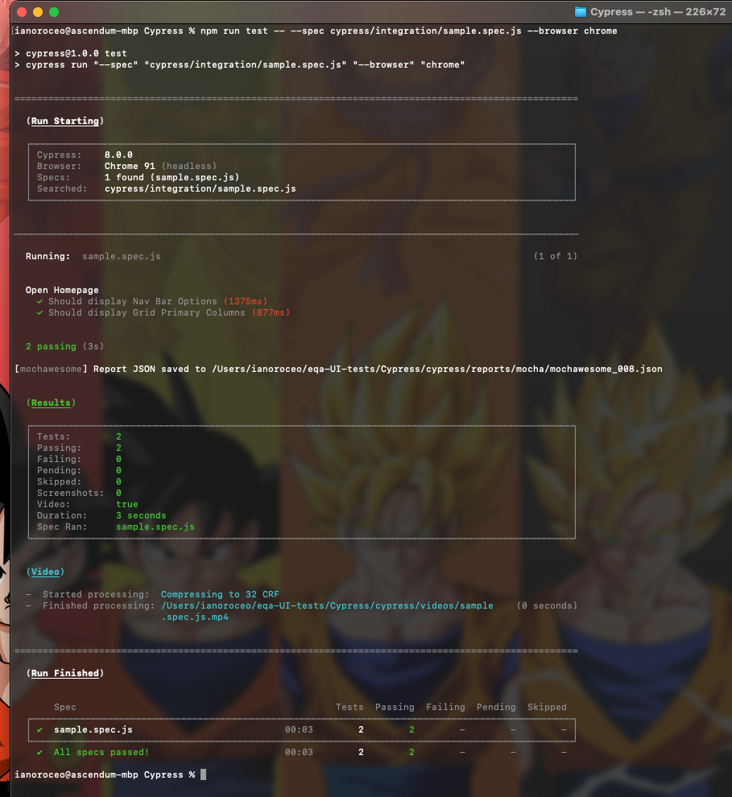
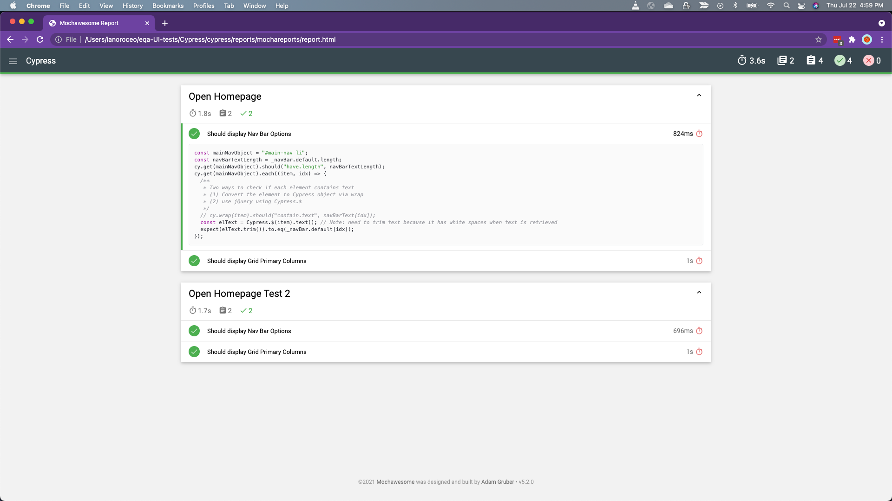

# Running Tests using Cypress

## Features

- [Chai](https://www.chaijs.com/)
- [Cypress](https://www.cypress.io/)
- [cypress-multi-reporters](https://www.npmjs.com/package/cypress-multi-reporters)
- [ESLint](https://eslint.org/)
- [Mocha](https://mochajs.org/)
- [mochawesome-merge](https://www.npmjs.com/package/mochawesome-merge)
- [mochawesome-report-generator](https://www.npmjs.com/package/mochawesome-report-generator)

> Note: Cypress uses Mocha and Chai as their underlying library does you cannot use any other Test Frameworks like Jasmine.

***

## Quick start

Choose one of the following options:

1. (Optional) Install nvm in your machine.
    - [Install nvm on Windows](https://codeburst.io/nvm-for-windows-how-to-install-and-use-13b7a4209791)
    - [Install nvm on Mac](https://nodesource.com/blog/installing-node-js-tutorial-using-nvm-on-mac-os-x-and-ubuntu/)

2. Install nodeJs using nvm. You can also install nodeJS without using nvm. Here are some references if you are installing not using nvm.
    - [Install nodeJs on Windows](https://phoenixnap.com/kb/install-node-js-npm-on-windows)
    - [Install nodeJs on Mac](https://www.webucator.com/how-to/how-install-nodejs-on-mac.cfm)

3. Install your favorite IDE. I used [VS Code](https://code.visualstudio.com/download) for this.

4. Clone the git repo — `https://github.com/vora/eqa-UI-tests.git`.

5. Run `npm install` to install the node packages

6. Create `.env` file and add

    ```console
    URL=https://www.ag-grid.com/example.php
    ```

7. When doing code changes, please run ESLint to check for coding standards. Run ESLint using this NPM script `npm run lint-fix` and it will automatically fix, coding standard issues that needed to be fixed

8. Things to remember about the framework

    | Folder Name  | Description       |
    |-------------|-------------------|
    | cypress | The test folder where all of your Cypress codes are built |
    | fixtures | Holds all of your data that you wanted to use across all of your test |
    | integration | Folder where you put all of your test spec files |
    | plugins | Folder that holds all of your plugins like compilers |
    | support | Treat this as your utility repository where you write your custom commands |
    | reports | All generated reports are stored in this folder |
    | videos | If a link project is specified in the cypress.json, it records the test and store it in this folder |

***

## Executing Tests

1. To open the Cypress electron app, run the following command line

    ```console
    npm run cypress:open
    ```

    This will open the Cypress Electron App and will show the list of your tests you have. As you make changes on your specific test spec file, it will reload and execute the test in the Electron App

2. To run all of the tests under the integration folder run the following command line

    ```console
    npm run test
    ```

    This will run all of your test spec files under the integration folder and by default it runs on the Cypress Electron App / Browser Headless. Every execution a mochawesome report is generated

    |  |  |
    |-------------|-------------------|

3. To run a specific test spec file, run the same command line but input the desired test spec file

    ```console
    npm run test -- --spec cypress/integration/sample.spec.js
    ```

    This will only run the specified test spec file.

    

4. To run the tests (or specific test spec file) in a browser, you pass the browser argument `--browser` in the command line. For more information please read the [Cypress Launching Browsers Documentation](https://docs.cypress.io/guides/guides/launching-browsers)

    ```console
    npm run test -- --spec cypress/integration/sample.spec.js --browser chrome
    ```
    
    

***

## Generating Reports

> Note: PLEASE REMEMBER that for every test execution a mochawesome json report is generated.

1. In order to get clean reports every test execution, make sure to run `npm run clean:reports` first to clean the reports folder

2. Every Test Spec file is a mochawesome json report and we want to combine them into one report. To combine them, run `npm run combine-reports` after the test execution. This will merge all mochawesome json report into one json report.

3. Json Reports are not really your typical report that you share with your team. After combining the report, we can generate a HTML report by running `npm run generate-report`. This will generate a HTML report that you can share your team



***

# Fun Fact

- You can run all of your tests and generate the report afterwards using only one npm script. Run the following command line

    ```console
    test:report
    ```
    This npm script will clean the reports folder, run the tests, merge all of the report and generate a HTML report at the end.